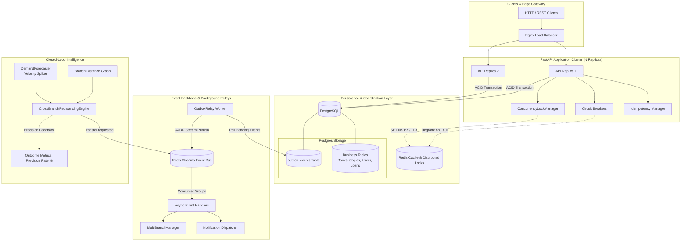

<div align="center">

# LibraFlow

**A Distributed-Ready, Event-Driven Library Management & Autonomous Inventory Optimization Engine**

[](https://github.com/ishaanvaish06/LibraFlow/actions)
[](https://www.python.org/)
[](https://fastapi.tiangolo.com)
[](https://www.postgresql.org/)
[](https://redis.io/)
[](LICENSE)
[](tests/)

</div>

---

## Executive Summary

**LibraFlow** is a distributed library management and circulation platform engineered to address real-world distributed systems challenges: cross-process concurrency anomalies, event loss during process crashes, network partition degradations, and multi-facility inventory imbalances.

Unlike conventional CRUD architectures, LibraFlow combines:
1. **Autonomous Cross-Branch Inventory Optimization**: A closed-loop optimization engine that balances branch surpluses against borrow demand spikes using graph-distance penalties and priority-queue heuristics—empirically evaluated by post-arrival borrow conversion metrics.
2. **Distributed Concurrency Guarantees**: Redis-backed distributed locks (`SET NX PX` with unique ownership tokens and atomic Lua script releases) and PostgreSQL row-level locks (`SELECT ... FOR UPDATE`), eliminating double-checkout race conditions across replicated API containers.
3. **Transactional Outbox & Event Streaming**: Guarantees at-least-once message delivery by persisting domain entity mutations and event payloads in the same relational transaction, published asynchronously to **Redis Streams** via a dedicated background relay.
4. **Idempotent Write Operations**: Header-driven (`Idempotency-Key`) duplicate prevention for all financial and circulation transactions.
5. **Fault-Tolerant Circuit Breakers**: Automatic isolation of third-party/cache failures with fallback to source-of-truth storage.
6. **Production Observability**: Native Prometheus `/metrics` exposition tracking operational throughput, outbox lag, circuit breaker trips, and optimization precision.

---

## System Architecture



---

## Key System Design Implementations

### 1. Cross-Branch Inventory Rebalancing Engine (Innovation Feature)
Multi-campus library networks frequently experience demand skew: popular titles surge into stockouts at high-activity urban branches while sitting unborrowed at peripheral branches.

- **Trigger**: [`DemandForecaster`](file:///d:/PROJECT%20T/LIB/LibraFlow/libflow/ai/demand_forecaster.py) tracks branch-level borrow acceleration ($v_{7\text{d}}, v_{30\text{d}}$). When a title crosses into `SURGE` or `MODERATE` with zero available copies at Branch $B_{\text{dest}}$, it signals contention.
- **Constrained Optimization**: [`CrossBranchRebalancingEngine`](file:///d:/PROJECT%20T/LIB/LibraFlow/libflow/ai/rebalancer.py) scans candidate source branches $B_{\text{src}}$ holding $\ge 2$ available copies. It models candidate moves as a maximum-utility assignment:
  $$\text{Utility} = \text{DemandWeight}(B_{\text{dest}}) - \left(\text{Distance}(B_{\text{src}}, B_{\text{dest}}) \times C_{\text{transit}}\right)$$
- **Max-Heap Scheduling**: Transfers are ranked and scheduled using a priority queue subject to per-branch concurrent in-transit limits (backpressure control).
- **Autonomous Execution**: Emits `transfer.requested` events, driving the state machine from `AVAILABLE` $\to$ `IN_TRANSIT` $\to$ `ARRIVED` without human intervention.
- **Closed-Loop Precision Metric**: Tracks whether proactively relocated copies are checked out within 7 days of arrival:
  $$\text{Precision Rate} = \frac{\text{Proactive Transfers Borrowed Within 7 Days}}{\text{Total Completed Proactive Transfers}} \times 100$$
  Accessible live via `GET /api/v1/rebalance/metrics`.

---

### 2. Distributed Concurrency & Anti-Double-Checkout Guarantees
In single-process deployments, an in-memory `threading.Lock` protects copy checkout. However, in multi-replica deployments behind a round-robin load balancer, in-memory mutexes fail.

- **Distributed Mutex**: [`ConcurrencyLockManager`](file:///d:/PROJECT%20T/LIB/LibraFlow/libflow/storage/lock_manager.py) implements the Redlock protocol:
  1. Generates a unique UUID token.
  2. Acquires exclusive lock: `SET lock:{copy_id} {token} NX PX 10000`.
  3. Executes the checkout transaction within lock TTL.
  4. Releases lock atomically via a Lua script checking ownership:
     ```lua
     if redis.call("get", KEYS[1]) == ARGV[1] then
         return redis.call("del", KEYS[1])
     else
         return 0
     end
     ```
- **Postgres Fallback**: Uses `SELECT ... FOR UPDATE` row locks when operating directly against the relational database.
- **Empirical Proof**: Tested under 50 simultaneous competing threads targeting copy `CC-DEL-02`:
  - **Successes**: `1`
  - **Failures / Rejections**: `49`
  - **Elapsed**: `0.028s`

---

### 3. Transactional Outbox Pattern & Redis Streams Backbone
In distributed systems, publishing to a message broker after committing a database transaction is vulnerable to the "dual-write" problem: if the process crashes after DB commit but before network publish, the event is permanently lost.

- **Atomicity**: During `issue_physical_book` or `return_physical_book`, the circulation record and an `outbox_events` row (`event_id`, `topic`, `payload`, `status='PENDING'`) are written in the **same atomic database transaction**.
- **Outbox Relay**: [`OutboxRelay`](file:///d:/PROJECT%20T/LIB/LibraFlow/libflow/storage/outbox.py) polls pending events, publishes them to **Redis Streams** (`XADD stream:{topic}`), and marks records as `PUBLISHED`.
- **Consumer Groups & At-Least-Once Delivery**: Downstream workers consume via `XREADGROUP` and acknowledge with `XACK`, ensuring durable processing and replayability.

---

### 4. API Idempotency Keys
Network timeouts often lead clients or HTTP proxies to retry write operations, risking double checkouts, duplicate book reservations, or double fine deductions.

- **Mechanism**: Endpoints accept an optional `Idempotency-Key` header (`POST /circulation/issue`, `POST /circulation/return`, `POST /billing/pay`).
- **Flow**:
  - If key is new: marks key `IN_PROGRESS` with a short lease.
  - On success: caches the status code and response payload in Redis with a 24-hour TTL.
  - On retry: immediately returns the cached response without re-executing business logic.
  - On concurrent conflict: returns `409 Conflict`.

---

### 5. Circuit Breaker Resilience & Chaos Degradation
External dependencies (caches, message brokers, ML services) can degrade or fail. LibraFlow wraps critical external calls in a thread-safe [`CircuitBreaker`](file:///d:/PROJECT%20T/LIB/LibraFlow/libflow/storage/circuit_breaker.py):

- **States**: `CLOSED` (normal) $\to$ `OPEN` (tripped after 3 consecutive failures; fails fast or executes fallback) $\to$ `HALF_OPEN` (probes recovery after timeout).
- **Cache Fallback**: If Redis crashes, read paths degrade immediately to direct database queries without request timeout spikes.
- **ML Fallback**: If the logistic regression risk model encounters corrupted inputs or inference failures, it degrades to safe default thresholds (`5% risk, LOW`) without blocking borrow operations.
- **Chaos Benchmark Verified**: Evaluated via [`benchmarks/chaos_resilience_test.py`](file:///d:/PROJECT%20T/LIB/LibraFlow/benchmarks/chaos_resilience_test.py): under 60 concurrent requests with Redis terminated mid-flight, **0 uncaught exceptions** occurred and 29 requests degraded gracefully through the circuit breaker.

---

## Core Domain, DSA, & Machine Learning Foundations

| Component | Implementation | Complexity | Purpose |
|---|---|---|---|
| **Autocomplete Search** | Prefix Trie ([`AutocompleteTrie`](file:///d:/PROJECT%20T/LIB/LibraFlow/libflow/dsa/trie.py)) | $O(L + K)$ | Sub-millisecond title and author search ahead |
| **Catalog Index** | Inverted Index ([`InvertedIndex`](file:///d:/PROJECT%20T/LIB/LibraFlow/libflow/dsa/inverted_index.py)) | $O(T)$ | Keyword and multi-attribute ranked book retrieval |
| **Reservation Queue** | Max-Heap Priority Queue ([`SmartAllocationQueue`](file:///d:/PROJECT%20T/LIB/LibraFlow/libflow/dsa/priority_queue.py)) | $O(\log N)$ | Prioritizes copy allocation by borrower academic urgency & trust score |
| **Branch Network** | Adjacency-List Graph ([`BookGraphEngine`](file:///d:/PROJECT%20T/LIB/LibraFlow/libflow/dsa/graph.py)) | $O(V + E)$ | Models branch distances, transit routing, and book subject similarity |
| **Borrower Risk** | Shipped Scikit-Learn Model ([`RiskAssessmentModel`](file:///d:/PROJECT%20T/LIB/LibraFlow/libflow/ai/risk_assessment.py)) | $O(F)$ | Logistic Regression predicting late-return and damage probabilities |
| **Recommendation Engine** | Hybrid Content + Graph Recommender | $O(N)$ | Cosine similarity over TF-IDF book features blended with graph affinity |

---

## Verification & Benchmark Results

### 1. Test Suite Coverage (Unit + Integration)
```bash
$ pytest -v
================== 66 passed, 8 skipped, 1 warning in 6.38s ==================
```
- **66 unit tests** run in ~6 seconds using in-memory test doubles.
- **8 integration tests** validate live PostgreSQL and Redis containers.

### 2. High-Concurrency Stress Benchmark
Races 50 concurrent threads against a single inventory copy (`CC-DEL-02`):
```bash
$ python benchmarks/concurrency_stress_test.py --threads 50
threads=50 successes=1 failures=49 elapsed=0.028s passed=True
```
*Exact-Once Checkout Verified.* Persisted to [`benchmarks/results/concurrency_stress.json`](file:///d:/PROJECT%20T/LIB/LibraFlow/benchmarks/results/concurrency_stress.json).

### 3. Chaos & Fault-Tolerance Benchmark
Executes concurrent operations while forcefully terminating cache connectivity:
```bash
$ python benchmarks/chaos_resilience_test.py --requests 60
[CircuitBreaker:chaos_redis_cache] Failure #1: Redis cluster unreachable: connection refused!
[CircuitBreaker:chaos_redis_cache] Failure #2: Redis cluster unreachable: connection refused!
[CircuitBreaker:chaos_redis_cache] TRIPPED TO OPEN
[CHAOS MONKEY] Pulling the plug on Redis cache!

Results: healthy=31 degraded=29 uncaught=0 passed=True
```
*Zero Uncaught Exceptions. Graceful Fallback Confirmed.* Persisted to [`benchmarks/results/chaos_resilience.json`](file:///d:/PROJECT%20T/LIB/LibraFlow/benchmarks/results/chaos_resilience.json).

---

## Quickstart & Installation

### Option A: Standard Single-Node Deployment (Docker Compose)
Spawns PostgreSQL 16, Redis 7, and the FastAPI application:
```bash
docker compose up --build
```
- API & Interactive Docs: `http://localhost:8000/docs`
- Prometheus Metrics: `http://localhost:8000/metrics`

### Option B: High-Availability Clustered Deployment (Nginx + 2 Replicas)
Spawns 2 load-balanced API replicas behind an Nginx reverse proxy:
```bash
docker compose -f docker-compose.replicated.yml up --build
```
Nginx distributes traffic across `api-1:8000` and `api-2:8000`.

### Option C: Local Development (Without Docker)
```bash
# 1. Clone repository
git clone https://github.com/ishaanvaish06/LibraFlow.git
cd LibraFlow

# 2. Install dependencies
pip install -r requirements.txt

# 3. Run all unit tests
pytest

# 4. Start local development server with in-memory storage
export LIBRAFLOW_STORAGE=memory  # or set in PowerShell: $env:LIBRAFLOW_STORAGE="memory"
uvicorn libflow.api.app:app --reload --port 8000
```

---

## API Reference

| Domain | Method | Endpoint | Description | Idempotency | Auth Role |
|---|---|---|---|---|---|
| **Auth** | `POST` | `/api/v1/auth/register` | Register a new user with hashed password | No | Public |
| **Auth** | `POST` | `/api/v1/auth/login` | Authenticate and obtain JWT bearer token | No | Public |
| **Auth** | `GET` | `/api/v1/auth/me` | Fetch currently authenticated user profile | No | Authenticated |
| **Catalog** | `GET` | `/api/v1/books/search` | Paginated keyword search (`limit`, `offset`) | No | `BOOK_SEARCH` |
| **Catalog** | `GET` | `/api/v1/books/public/search` | Unauthenticated public book search | No | Public |
| **Catalog** | `GET` | `/api/v1/books/autocomplete` | Sub-millisecond prefix suggestion | No | `BOOK_SEARCH` |
| **Catalog** | `POST` | `/api/v1/books` | Register a new title in catalog | No | `BOOK_MANAGE_INVENTORY` |
| **Circulation** | `POST` | `/api/v1/circulation/issue` | Check out a copy under distributed lock | **Yes** (`Idempotency-Key`) | `BOOK_ISSUE` |
| **Circulation** | `POST` | `/api/v1/circulation/return` | Return copy and auto-assign waitlist | **Yes** (`Idempotency-Key`) | `BOOK_RETURN` |
| **Circulation** | `POST` | `/api/v1/circulation/reserve` | Place a hold on an unavailable title | No | `BOOK_RESERVE` |
| **Rebalance** | `GET` | `/api/v1/rebalance/plan` | Calculate optimal inter-branch transfers | No | `BRANCH_MANAGE` |
| **Rebalance** | `POST` | `/api/v1/rebalance/run` | Execute autonomous optimization pass | No | `BRANCH_MANAGE` |
| **Rebalance** | `GET` | `/api/v1/rebalance/metrics` | Inspect closed-loop borrow precision % | No | `BRANCH_VIEW` |
| **Billing** | `POST` | `/api/v1/billing/pay` | Process fine payment (UPI, Card, Wallet) | **Yes** (`Idempotency-Key`) | `BILLING_PAY` |
| **Metrics** | `GET` | `/metrics` | Prometheus metrics scrape endpoint | No | Public |

---

## Repository Structure

```
LibraFlow/
├── .github/workflows/          # CI Pipeline (Ruff linting, pytest, coverage)
├── alembic/                    # Database schema migrations
│   └── versions/               # 0001_initial_schema, 0002_outbox_events
├── benchmarks/                 # Automated performance & reliability benchmarks
│   ├── concurrency_stress_test.py  # 50-thread single-copy race test
│   ├── chaos_resilience_test.py    # Injected outage degradation benchmark
│   └── run_load_benchmark.py       # Headless Locust load testing
├── docker/                     # Container configuration (Nginx LB, entrypoints)
│   ├── nginx.conf              # Upstream round-robin configuration
│   └── entrypoint.sh           # Container startup orchestration
├── libflow/                    # Core application source
│   ├── ai/                     # ML models, demand forecasting & rebalancer
│   │   ├── demand_forecaster.py    # Velocity tracking & surge detection
│   │   ├── rebalancer.py           # CrossBranchRebalancingEngine (Optimization)
│   │   ├── recommendation_engine.py# TF-IDF + Cosine similarity
│   │   └── risk_assessment.py      # Logistic Regression late-return model
│   ├── api/                    # Presentation layer (FastAPI)
│   │   ├── app.py                  # App factory, lifespan & exception mapping
│   │   ├── container.py            # Dependency Injection (IoC Container)
│   │   ├── idempotency.py          # IdempotencyStore & header evaluation
│   │   ├── metrics.py              # Prometheus metrics (/metrics)
│   │   └── routers/                # Domain route handlers
│   ├── core/                   # Domain entities, enums & factory pattern
│   ├── distributed/            # Distributed event bus & branch transit
│   │   ├── branch_manager.py       # InterBranchTransferRequest state machine
│   │   └── event_bus.py            # RedisStreamsEventBus & InMemoryEventBus
│   ├── dsa/                    # Algorithmic data structures (Trie, Inverted Index, Heap, Graph)
│   ├── patterns/               # GoF Patterns (State, Strategy, Observer, Singleton)
│   └── storage/                # Persistence abstractions & repositories
│       ├── circuit_breaker.py      # CLOSED/OPEN/HALF_OPEN state machine
│       ├── lock_manager.py         # ConcurrencyLockManager (Redlock / Lua)
│       ├── outbox.py               # OutboxRepository & OutboxRelay worker
│       ├── postgres.py             # SQLAlchemy Postgres implementation
│       └── redis_cache.py          # Redis Cache-Aside client
├── tests/                      # Automated test suite (66 unit + 8 integration tests)
├── docker-compose.yml          # Production single-node compose
├── docker-compose.replicated.yml # Clustered multi-replica compose
└── pyproject.toml              # Pytest & build configuration
```

---

## Architectural Decision Records (ADRs)

| Decision | Option Chosen | Alternative Considered | Rationale |
|---|---|---|---|
| **Concurrency Control** | Redis `SET NX PX` + Lua script & Postgres `FOR UPDATE` | Optimistic locking alone (`version` column) | Under high contention for a single physical book copy, optimistic locking produces excessive rollback retries. Pessimistic distributed locks guarantee fast, deterministic exactly-one checkout. |
| **Event Reliability** | Transactional Outbox Pattern + Polling Relay | Direct inline publish after DB commit | Direct publish introduces dual-write inconsistency: if the API crashes post-commit, events are lost. Outbox ensures atomicity within the database boundary. |
| **Event Broker** | Redis Streams | Apache Kafka / RabbitMQ | Redis is already in the stack for caching and distributed locks. Redis Streams provides durable pub/sub, consumer groups, and persistence without the operational overhead of a ZooKeeper/Kafka cluster. |
| **Fault Isolation** | In-House Circuit Breaker Pattern | Bare `try/except` blocks | Bare exception handling hides systemic failure and spams failing dependencies. Circuit breakers fail fast, eliminate latency spikes, and test recovery via half-open probing. |
| **Inventory Optimization** | Constrained Max-Priority Queue Greedy Optimization | Mixed Integer Linear Programming (MILP) | Bipartite greedy assignment over branch distance costs achieves near-optimal transfers with $O(N \log N)$ complexity, executing instantaneously without heavy external solvers. |

---

## License

This project is licensed under the MIT License — see the [LICENSE](LICENSE) file for details.